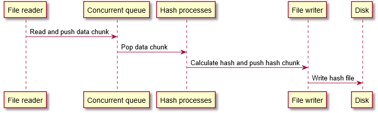
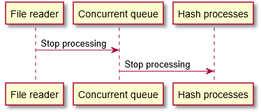

# Signature

This project is simple file signature creator.  

Used libraries:
* **Pthread** for c++ thread management (standard).
* **[Openssl](https://github.com/openssl/openssl)** for MD5 hash calculation.

Architecture:

* FileReader class (one instance): reads input file, create data chunks with specified lenght 
and push they  to ConcurrentQueue.

* ConcurentQueue class (one instance): synchronization point. Store DataChunks for next processing. 
Sends signals about Push, Pop and StopProcess events.

* HashProcess class (many instances): transforms input DataChunk to MD5 DataChunk and push it to 
FileWriter.

* FileWriter class (one instance): waits on MD5 DataChunks and writes they to output file.

DataChunk flow:

Stop signal flow:

FileWriter will be stopped, when it gets all MD5 DataChunks and will write they on disk.

In fatal error case std::abort() stops program execution.